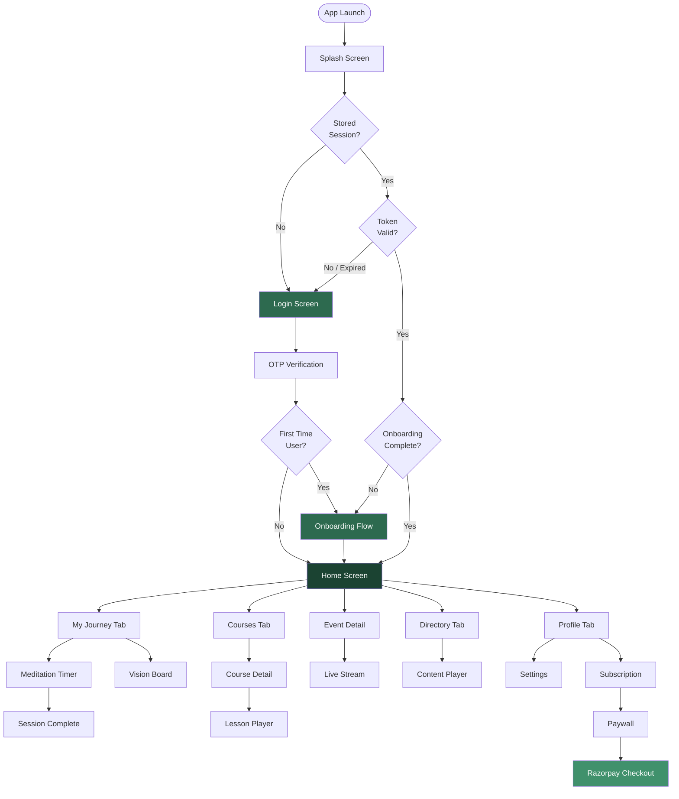
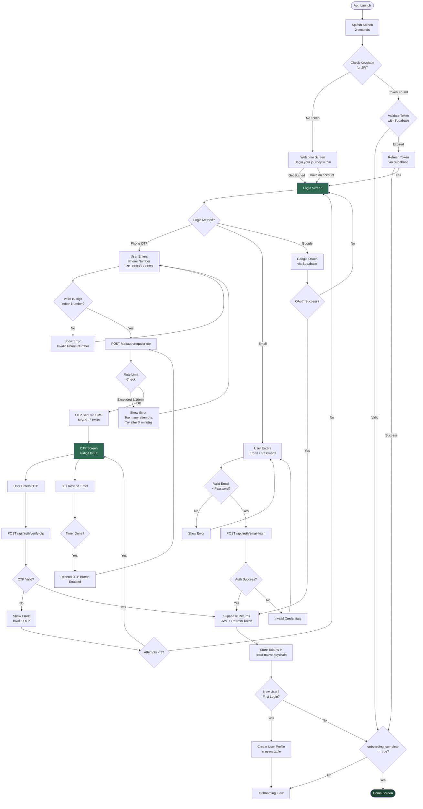
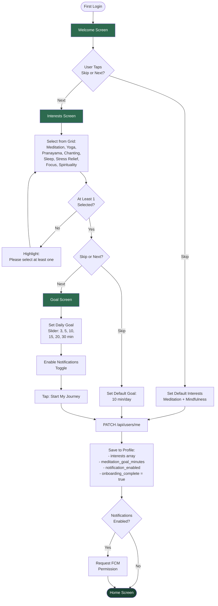
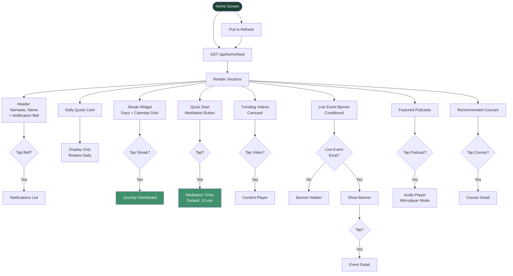
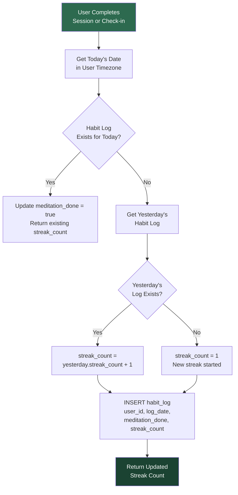
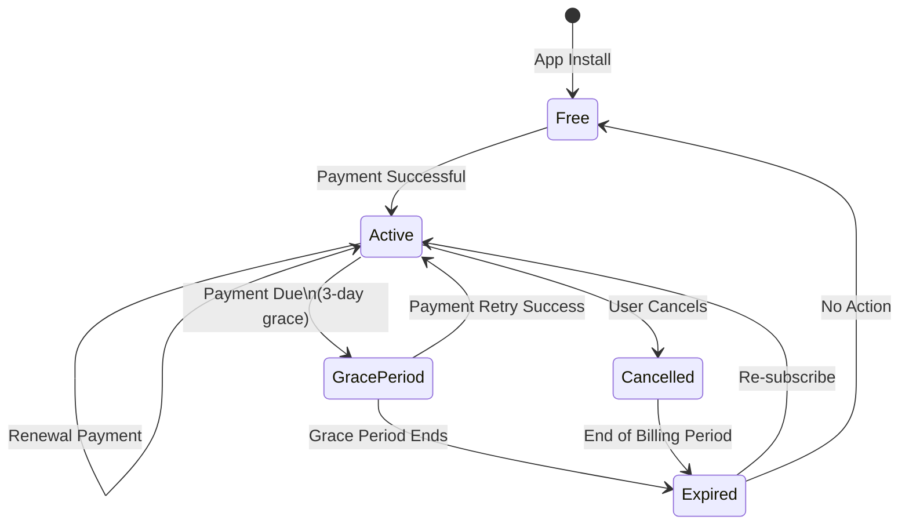
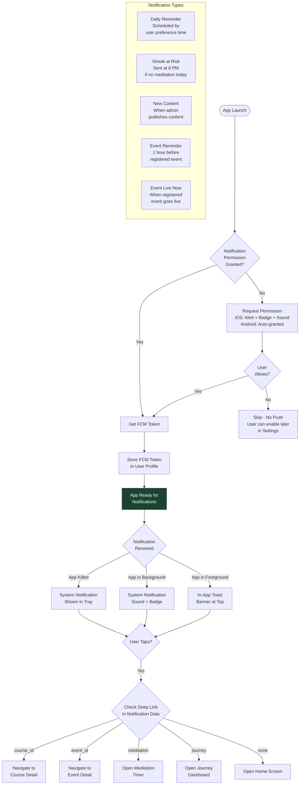
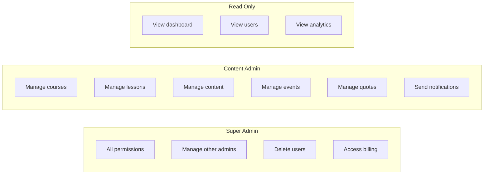
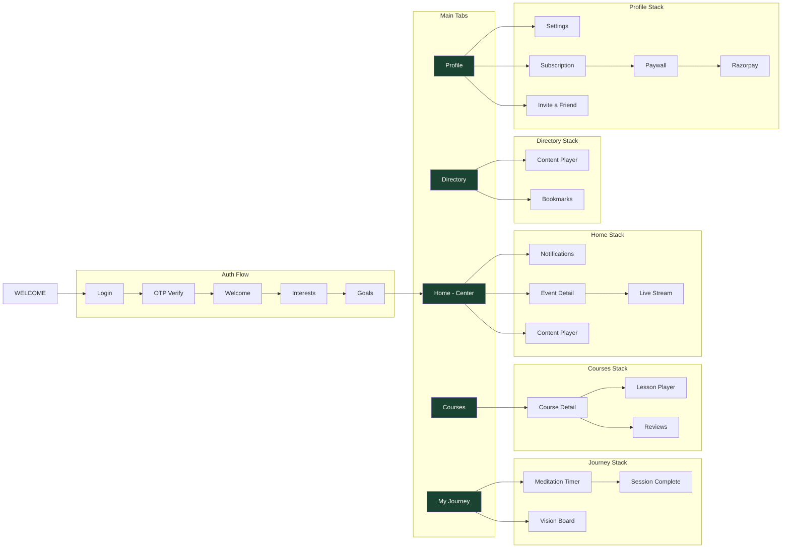

# MAM Meditation App - User Flow Diagrams

> These diagrams use Mermaid syntax and render directly on GitHub.
> **Updated**: 2026-04-02 (post-Figma review — auth methods, tab structure, new features)
> **Changes**: See [DESIGN_UPDATES.md](DESIGN_UPDATES.md) for full changelog

---

## Table of Contents

1. [Complete App Overview](#1-complete-app-overview)
2. [Authentication Flow](#2-authentication-flow)
3. [Onboarding Flow](#3-onboarding-flow)
4. [Home Screen Flow](#4-home-screen-flow)
5. [Course & Lesson Flow](#5-course--lesson-flow)
6. [Meditation Timer Flow](#6-meditation-timer-flow)
7. [Habit Tracking & Journey Flow](#7-habit-tracking--journey-flow)
8. [Content Directory Flow](#8-content-directory-flow)
9. [Events Flow](#9-events-flow)
10. [Payment & Subscription Flow](#10-payment--subscription-flow)
11. [Profile & Settings Flow](#11-profile--settings-flow)
12. [Notification Flow](#12-notification-flow)
13. [Admin Panel Flow](#13-admin-panel-flow)

---

## 1. Complete App Overview



---

## 2. Authentication Flow



### Authentication Flow Summary

| Step | Screen | API Call | Data |
|------|--------|----------|------|
| 1 | Login | — | User enters phone |
| 2 | Login | POST /api/auth/request-otp | Phone number sent |
| 3 | OTP | — | User enters 6-digit code |
| 4 | OTP | POST /api/auth/verify-otp | Phone + OTP sent |
| 5 | — | — | JWT stored in Keychain |
| 6 | Onboarding / Home | — | Redirect based on status |

---

## 3. Onboarding Flow



---

## 4. Home Screen Flow



---

## 5. Course & Lesson Flow

```mermaid
flowchart TD
    A([Courses Tab]) --> B[GET /api/courses\nwith default filters]

    B --> C[Course Listing Screen]

    C --> D[Filter Bar:\nDifficulty | Category\nFree/Premium | Sort]

    D --> E{Apply Filter?}
    E -->|Yes| F[GET /api/courses\n?difficulty=X&category=Y]
    F --> C

    C --> G{Scroll to\nBottom?}
    G -->|Yes| H[Load Next Page\nInfinite Scroll]
    H --> C

    C --> I{Tap Course\nCard?}
    I -->|Yes| J[GET /api/courses/:id]
    J --> K[Course Detail Screen]

    K --> L[Show:\n- Hero Image\n- Title + Instructor\n- Difficulty Badge\n- Description\n- Lesson List\n- Progress Bar]

    K --> M{User\nEnrolled?}
    M -->|No| N{Course\nFree?}

    N -->|Yes| O[Show: Enroll Button]
    N -->|No / Premium| P{User Has\nPremium?}

    P -->|Yes| O
    P -->|No| Q[Show: Premium Lock\nUpgrade to Access]
    Q --> R{Tap Upgrade?}
    R -->|Yes| S[Paywall Screen]

    O --> T{Tap Enroll?}
    T -->|Yes| U[POST /api/courses/:id/enroll]
    U --> V[Enrollment Created\nShow Lesson List]

    M -->|Yes| V

    V --> W{Tap Lesson?}
    W -->|Yes| X{Lesson\nMedia Type?}

    X -->|Video| Y[Video Player\nreact-native-video]
    X -->|Audio| Z[Audio Player\nreact-native-track-player]

    Y --> AA[Player Controls:\nPlay/Pause | Seek\nSpeed 0.5x-2x]
    Z --> AB[Player Controls:\nPlay/Pause | Seek\nSpeed | Background Play\nLock Screen Controls]

    AA --> AC{Lesson\nCompleted?}
    AB --> AC

    AC -->|Yes| AD[PATCH /api/enrollments/:id/progress\nUpdate progress_pct\nUpdate current_lesson_id]

    AD --> AE{More\nLessons?}
    AE -->|Yes| AF[Auto-Advance\nto Next Lesson]
    AF --> W
    AE -->|No| AG[Course Complete!\nShow Completion Card]

    style A fill:#1B4332,color:#fff
    style K fill:#2D6A4F,color:#fff
    style Y fill:#40916C,color:#fff
    style Z fill:#40916C,color:#fff
    style AG fill:#1B4332,color:#fff
```

---

## 6. Meditation Timer Flow

```mermaid
flowchart TD
    A([Meditate Tab\nor Quick Start]) --> B[Meditation Timer Screen\nFull Screen Dark UI]

    B --> C[Select Duration\n3 | 5 | 10 | 15 | 20 | 30 min]
    B --> D[Select Session Type\nFree | Guided | Breathing]
    B --> E[Select Ambient Sound\nNature | Rain | Ocean\nBirds | Singing Bowl | Silence]

    C --> F[Duration Set]
    D --> F
    E --> F

    F --> G{Tap Start?}
    G -->|Yes| H[Timer Starts\nBreathing Animation\nPlays Ambient Sound]

    H --> I[Large Timer Display\nmm:ss Countdown]

    I --> J{User Action?}

    J -->|Pause| K[Timer Paused\nSound Paused]
    K --> L{Resume?}
    L -->|Yes| I
    L -->|Stop| M[Confirm: End Session?]

    J -->|App Backgrounded| N[Timer Continues\nin Background]
    N --> I

    J -->|Timer Reaches 0:00| O[Gentle Bell Sound]

    M -->|Yes, End| P[Calculate Actual\nDuration Meditated]
    M -->|No, Continue| I

    O --> P

    P --> Q[POST /api/sessions\nduration, type,\nambient_sound, started_at]

    Q --> R[Check Habit Log\nfor Today]
    R --> S{Habit Log\nExists Today?}

    S -->|No| T[Create Habit Log\nCalculate Streak]
    S -->|Yes| U[Update: meditation_done = true]

    T --> V[Session Complete Screen\nDuration | Streak Count\nMotivational Message]
    U --> V

    V --> W{User Action?}
    W -->|Meditate Again| B
    W -->|View Journey| X[Journey Dashboard]
    W -->|Go Home| Y([Home Screen])

    style B fill:#1A1A2E,color:#fff
    style H fill:#1A1A2E,color:#fff
    style O fill:#40916C,color:#fff
    style V fill:#1B4332,color:#fff
```

---

## 7. Habit Tracking & Journey Flow

```mermaid
flowchart TD
    A([Journey Tab]) --> B[GET /api/habits/streak]

    B --> C[Journey Dashboard]

    C --> D[Current Streak\nLarge Number Display]
    C --> E[Longest Streak Record]
    C --> F[7-Day Calendar\nDots for completed days]
    C --> G[Monthly Heatmap\nContribution Graph Style]
    C --> H[Stats Row:\nTotal Sessions\nTotal Minutes\nAvg Duration]
    C --> I[Weekly Trend\nBar Chart]
    C --> J[Daily Check-In Card]

    J --> K{Meditated Today\nvia Timer?}
    K -->|Yes| L[Auto checked.\nShow: Completed Today!]
    K -->|No| M[Show: Did you\nmeditate today?]

    M --> N{Tap Yes?}
    N -->|Yes| O[Select Mood:\nGreat | Good | Okay\nLow | Bad]
    O --> P[POST /api/habits/checkin\nmood + optional notes]
    P --> Q[Streak Updated\nDashboard Refreshes]

    N -->|Not Yet| R[Show: Gentle Reminder\nTap to start meditating]
    R --> S{Tap?}
    S -->|Yes| T[Open Meditation Timer]

    style C fill:#1B4332,color:#fff
    style D fill:#40916C,color:#fff
    style Q fill:#2D6A4F,color:#fff
```

### Streak Calculation Logic



---

## 8. Content Directory Flow

```mermaid
flowchart TD
    A([Content Directory\nvia Home or Tab]) --> B[GET /api/directory\ndefault: all content]

    B --> C[Directory Screen]

    C --> D[Search Bar\nDebounced Input]
    C --> E[Category Tabs:\nAll | Videos | Audio | Articles]
    C --> F[Content Grid\nCards with:\nType Icon | Title\nDuration | Premium Badge]

    D --> G{User Types\nSearch Query?}
    G -->|Yes, after 300ms| H[GET /api/directory\n?q=search_term]
    H --> F

    E --> I{Tap Category?}
    I -->|Yes| J[GET /api/directory\n?category=video]
    J --> F

    F --> K{Tap Content\nCard?}

    K -->|Yes| L{Is Premium\nContent?}

    L -->|No| M[Open Media Player]
    L -->|Yes| N{User Has\nPremium?}

    N -->|Yes| M
    N -->|No| O[Show Premium Lock\nUpgrade to Access]
    O --> P{Tap Upgrade?}
    P -->|Yes| Q[Paywall Screen]

    M --> R{Content Type?}
    R -->|Video| S[Full Screen\nVideo Player]
    R -->|Audio| T[Mini Player\nBackground Listening]
    R -->|Article| U[Article Reader\nScrollable View]

    F --> V{Scroll to Bottom?}
    V -->|Yes| W[Load Next Page]
    W --> F

    style C fill:#1B4332,color:#fff
    style S fill:#40916C,color:#fff
    style T fill:#40916C,color:#fff
```

---

## 9. Events Flow

```mermaid
flowchart TD
    A([Events Tab]) --> B[GET /api/events]

    B --> C[Events Screen\nUpcoming Events\nSorted by Date]

    C --> D[Event Card:\nImage | Title\nDate & Time | Instructor\nRegistered Count]

    D --> E{Tap Event?}
    E -->|Yes| F[Event Detail Screen]

    F --> G[Show:\n- Full Description\n- Instructor Bio\n- Date & Time\n- Category\n- Registration Status]

    F --> H{User\nRegistered?}

    H -->|No| I[Show: Register Button]
    I --> J{Tap Register?}
    J -->|Yes| K[POST /api/events/:id/register]
    K --> L{Is Premium\nEvent?}

    L -->|No| M[Registration Confirmed]
    L -->|Yes| N{User Has\nPremium?}
    N -->|Yes| M
    N -->|No| O[Show: Premium Required\nUpgrade to Register]

    H -->|Yes| P{Event\nStatus?}

    P -->|Upcoming| Q[Show:\nAdd to Calendar\n+ Countdown Timer]
    Q --> Q1{Tap Add\nto Calendar?}
    Q1 -->|Yes| Q2[Open Device Calendar\nPre-filled Event]

    P -->|Live Now| R[Show: Join Live Button\nPulsing Red Indicator]
    R --> S{Tap Join?}
    S -->|Yes| T[GET /api/events/:id/stream]
    T --> U[Open HLS\nVideo Stream\nIn-App Player]

    P -->|Ended| V{Event\nRecorded?}
    V -->|Yes, Premium| W[Show: Watch Replay]
    W --> X[Play Recording]
    V -->|No| Y[Show: Event Has Ended]

    M --> P

    style C fill:#1B4332,color:#fff
    style U fill:#40916C,color:#fff
    style R fill:#cc3333,color:#fff
```

---

## 10. Payment & Subscription Flow

```mermaid
flowchart TD
    A([Paywall Screen\nTriggered from:\n- Premium Content\n- Profile > Subscription\n- Upgrade CTA]) --> B[Paywall Screen]

    B --> C[Feature Comparison\nFree vs Premium]

    B --> D[Plan Cards]
    D --> E[Monthly: INR 199/mo]
    D --> F[Annual: INR 1,499/yr\nSave 37% Badge]

    E --> G{User Selects\nPlan?}
    F --> G

    G -->|Monthly| H[selected_plan = monthly]
    G -->|Annual| I[selected_plan = annual]

    H --> J[Tap: Subscribe Now]
    I --> J

    J --> K[POST /api/payments/create-order\nplan_type, amount]

    K --> L[Backend Creates\nRazorpay Order\nReturns order_id]

    L --> M[Open Razorpay\nCheckout Modal]

    M --> N[User Sees:\nUPI | Cards | Wallets\nNet Banking Options]

    N --> O{Payment\nResult?}

    O -->|Success| P[Razorpay Returns:\nrazorpay_order_id\nrazorpay_payment_id\nrazorpay_signature]

    P --> Q[POST /api/payments/verify\nSend all 3 values]

    Q --> R{Signature\nValid?}

    R -->|Yes| S[Backend:\n1. Update payment status\n2. Create subscription\n3. Set expires_at]
    S --> T[Success Screen:\nWelcome to Premium!\nShow what's unlocked]
    T --> U[Update Local State:\nisPremium = true]
    U --> V([Return to Previous\nScreen - Content\nNow Unlocked])

    R -->|No| W[Payment Verification\nFailed - Contact Support]

    O -->|Failed| X[Payment Failed Screen\nTry Again Button]
    X --> J

    O -->|Cancelled| Y[Return to Paywall\nNo Changes]

    style B fill:#1B4332,color:#fff
    style M fill:#2D6A4F,color:#fff
    style T fill:#40916C,color:#fff
    style V fill:#1B4332,color:#fff
```

### Subscription Lifecycle



---

## 11. Profile & Settings Flow

```mermaid
flowchart TD
    A([Profile Tab]) --> B[GET /api/users/me]

    B --> C[Profile Screen]

    C --> D[Avatar + Name + Phone]
    C --> E[Stats Row:\nTotal Sessions | Total Hours\nLongest Streak]
    C --> F[Membership Badge\nFree / Premium]
    C --> G[Settings List]

    D --> H{Tap Avatar?}
    H -->|Yes| I[Camera / Gallery Picker]
    I --> J[Upload to R2\nPATCH /api/users/me\navatar_url updated]

    D --> K{Tap Name?}
    K -->|Yes| L[Edit Name Modal]
    L --> M[PATCH /api/users/me\nname updated]

    F --> N{Tap Membership?}
    N -->|Yes| O[Subscription Screen]

    O --> P[Show:\n- Current Plan\n- Expiry Date\n- Billing History]
    O --> Q{Is Free User?}
    Q -->|Yes| R[Show: Upgrade Button]
    R --> S[Paywall Screen]
    Q -->|No| T[Show: Cancel Button]

    G --> G1[Notification Preferences]
    G --> G2[Theme: Light / Dark]
    G --> G3[Meditation Sounds]
    G --> G4[Language]
    G --> G5[About]
    G --> G6[Logout]

    G1 --> G1A[Toggle:\n- Daily Reminders\n- Event Alerts\n- New Content\n- Streak Reminders]
    G1A --> G1B[PATCH /api/users/me\nnotification preferences]

    G6 --> G6A{Confirm\nLogout?}
    G6A -->|Yes| G6B[Clear Keychain Tokens\nClear Zustand Store\nSupabase signOut]
    G6B --> G6C([Login Screen])

    style C fill:#1B4332,color:#fff
    style G6C fill:#2D6A4F,color:#fff
```

---

## 12. Notification Flow



---

## 13. Admin Panel Flow

```mermaid
flowchart TD
    A([Admin Panel URL]) --> B[Admin Login Page\nEmail + Password]

    B --> C[Supabase Auth\nVerify Credentials]
    C --> D{Valid Admin\nRole?}
    D -->|No| E[Access Denied\nNot an admin account]
    D -->|Yes| F[Admin Dashboard]

    F --> G[Sidebar Navigation]

    G --> H[Dashboard\nDAU/MAU Charts\nRevenue | Retention\nActive Users]

    G --> I[Users\nSearch | Filter\nView Details\nSuspend/Ban]

    G --> J[Courses\nCreate | Edit | Delete\nPublish/Unpublish\nView Enrollments]

    G --> K[Lessons\nSelect Course First\nAdd | Edit | Delete\nUpload Media\nDrag Reorder]

    G --> L[Content\nUpload Videos/Audio\nManage Categories\nSet Tags\nPremium Toggle]

    G --> M[Events\nCreate | Edit | Delete\nSet Stream URL\nView Registrations]

    G --> N[Quotes\nAdd | Edit | Delete\nBulk CSV Upload\nSchedule by Date]

    G --> O[Notifications\nCompose Message\nSelect Target:\nAll Users | Segment\nSchedule or Send Now]

    G --> P[Subscriptions\nActive Count\nRevenue Charts\nConversion Funnel\nChurn Rate]

    G --> Q[Settings\nAdmin Profile\nRole Management]

    J --> J1[Create Course Modal:\nTitle | Description\nThumbnail Upload\nDifficulty | Category\nis_premium | Order]

    K --> K1[Upload Lesson:\nTitle | Media File\nVideo or Audio\nDuration Auto-detect\nOrder Position]

    K1 --> K2[Media Upload\nto Cloudflare R2]

    O --> O1[Compose:\nTitle | Body\nDeep Link URL]
    O1 --> O2[Target:\nAll | By Interest\nBy Subscription\nSpecific Users]
    O2 --> O3[Send via FCM\nfirebase-admin SDK]

    style F fill:#1B4332,color:#fff
    style J fill:#2D6A4F,color:#fff
    style K fill:#2D6A4F,color:#fff
    style O fill:#2D6A4F,color:#fff
```

### Admin Role Permissions



---

## Navigation Map (All Screens)



---

*All diagrams render on GitHub. If viewing locally, use a Mermaid-compatible viewer or VS Code with the Mermaid extension.*
